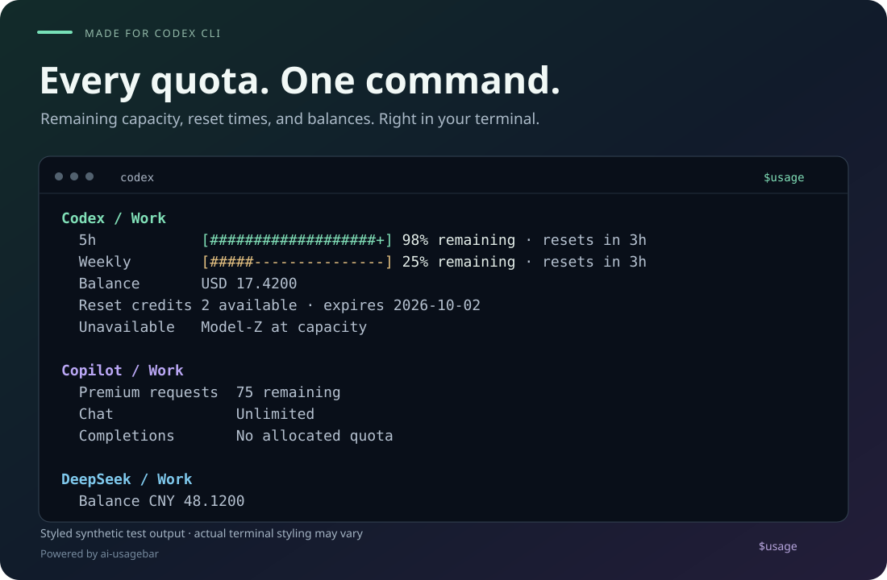

<div align="center">

<h1>usage for Codex CLI</h1>

<p>Know what's left. Keep building.</p>

<p><strong>English</strong> · <a href="README.zh-CN.md">简体中文</a></p>
<p><a href="#install">Quick start</a> · <a href="#usage">Usage</a> · <a href="#troubleshooting">Troubleshooting</a></p>

</div>



Type `$usage` inside Codex CLI to see remaining quotas, reset times, and balances across your configured AI accounts. Powered by [ai-usagebar](https://github.com/akitaonrails/ai-usagebar).

*Styled preview using synthetic test data. Colors are illustrative; CLI reports default to English.*

<details>
<summary>View the example as plain text</summary>

```text
Codex / Work
  5h            [###################+] 98% remaining · resets in 3h
  Weekly        [#####---------------] 25% remaining · resets in 3h
  Balance       USD 17.4200
  Reset credits 2 available · expires 2026-10-02
  Unavailable   Model-Z at capacity

Copilot / Work
  Premium requests  75 remaining
  Chat              Unlimited
  Completions       No allocated quota

DeepSeek / Work
  Balance CNY 48.1200
```

</details>

## At a glance

| Capacity | Context | Simplicity |
| :--- | :--- | :--- |
| Remaining bars and request counts | Reset times and paid balances | One skill, one command |
| Separate accounts and quota windows | Clear cache and availability status | Full source detail on request |

Provider availability comes from your ai-usagebar installation and configuration. The example shows Codex, GitHub Copilot, and DeepSeek; see [upstream configuration](https://github.com/akitaonrails/ai-usagebar/blob/main/docs/configuration.md) for other providers and account setup.

## Install

### 1. Set up ai-usagebar

Install [Codex CLI](https://developers.openai.com/codex/cli) and follow [ai-usagebar's installation guide](https://github.com/akitaonrails/ai-usagebar#install) to install the backend and configure the providers you want to query.

Check that the backend is available in the terminal where you use Codex:

```sh
ai-usagebar --version
ai-usagebar usage --json
ai-usagebar vendors --json
```

If these commands report a missing installation or account configuration, resolve that in ai-usagebar first. This skill uses its existing provider setup.

### 2. Add the skill to Codex

Paste this into **Codex**, rather than your shell:

```text
$skill-installer Install the entire usage skill from https://github.com/wellorbetter/ai-usagebar-codex-skill/tree/main/usage, including scripts and references. Confirm the files were copied, say separately whether the backend was actually tested, and tell me to try $usage next turn. If it is not detected, suggest restarting Codex. Do not install runtimes or change global configuration.
```

<details>
<summary>Manual installation</summary>

Clone this repository, or download its ZIP and extract it:

```sh
git clone https://github.com/wellorbetter/ai-usagebar-codex-skill.git
```

Copy the **entire `usage` folder**, including `scripts` and `references`, to one of these locations:

| Scope | Destination |
| --- | --- |
| Your user, across projects | `~/.agents/skills/usage/` |
| One repository | `<repository>/.agents/skills/usage/` |

On Windows, `~` means your user profile directory, such as `C:\Users\you`. Create the parent folders if needed. If a `usage` skill is already installed, back it up before replacing it.

The final folder should look like this:

```text
.agents/skills/usage/
├── SKILL.md
├── scripts/
│   └── render.mjs
└── references/
    └── report.md
```

Check that you have `usage/SKILL.md`, not `usage/usage/SKILL.md`. You do not need to copy the tests or build the repository.

</details>

These locations and the installer workflow follow the [official Codex skills guide](https://learn.chatgpt.com/docs/build-skills). Codex detects installed and changed skills automatically; try `$usage` next turn. If it is not picked up, restart Codex. For a repository installation, launch Codex inside that repository.

**Installation complete:** the full skill folder should now be present. Try $usage in your next Codex turn; restart only if it is not detected. Copied files do not prove your backend/account setup works—the first query checks that separately.

Node.js 20+ enables the optional bundled color renderer. If it is absent, usage still returns the complete plain report; queries do not install a runtime for you.

### 3. Check your usage

In Codex CLI, type:

```text
$usage
```

Codex runs the backend queries and returns a readable report. `$usage` is a skill invocation inside Codex; it is not a shell executable or a built-in `/usage` command.

## Usage

| Ask Codex | What you get |
| --- | --- |
| `$usage` | Remaining capacity, reset times, balances, and actionable problems. |
| `$usage details` | Original reported values, quota windows, balance breakdowns, freshness, and diagnostics. |
| `$usage show provider configuration details` | Configuration information from the provider catalog. |

Generated headings and status text default to **English**, even in a conversation in another language. Provider names, account names, and source data keep their meaning.

**Reading the bars:** a fuller bar means more remaining capacity. Known used percentages are converted to remaining; values with unknown or conflicting meaning are kept without a misleading remaining bar. Details preserves the original reported direction, so its percentages may differ from the default view.

**Refreshing:** each invocation queries ai-usagebar, which manages fetching and caching. If the result is stale, the skill can retry once through an existing usable proxy. If refreshing still fails, it shows the usable cached values with a short reason. It is an on-demand report; rerun `$usage` for another check.

### Color and folded output

The bundled renderer can show colored tool output in compatible Codex CLI versions. The final assistant report stays complete plain text, so folded output never hides the information you need. In the tested Windows CLI 0.154.0-alpha.6.2, Ctrl+T expands the transcript; other versions may differ. The preview above is synthetic and does not guarantee identical terminal colors.

Ask for plain text/no color to disable the renderer’s colors. Auto mode respects NO_COLOR, TERM=dumb and TTY detection. For a known compatible Codex tool view, the skill can explicitly request color even though Codex injects disabled-color defaults into tool subprocesses. The parent TUI still decides how that output is displayed. The skill does not change your environment or Codex configuration. If you choose to change an inherited terminal setting yourself, restart the relevant parent terminal/Codex process to pick it up. Do not restart merely because a plain report is otherwise working.

## Troubleshooting

| What you see | What to check |
| --- | --- |
| Codex cannot find `usage` | Verify the installed folder structure above, then restart Codex. |
| `ai-usagebar` cannot be launched | Check that it is installed and available on the PATH inherited by Codex. |
| A provider needs configuration or sign-in | Follow [upstream configuration](https://github.com/akitaonrails/ai-usagebar/blob/main/docs/configuration.md), then rerun `$usage`. |
| A cached result or refresh error | Check the backend's connectivity and your existing proxy setup. Use `$usage details` for diagnostics. |
| A provider or window is missing | Check `ai-usagebar usage --json` directly. The skill can only display data the backend returns. |
| No color, or renderer unavailable | The plain report is complete. Check optional Node.js 20+, the installed scripts folder, and existing NO_COLOR/TERM settings. Color support is separate from backend configuration. |
| A value has no remaining bar | Its meaning may be unknown, conflicting, unlimited, or unallocated. Details shows the source values. |

To update a manual installation, get the latest repository version and replace the installed `usage/` folder after backing up any local changes. Keep `SKILL.md`, `scripts/` and `references/` together. Use this backup-and-replace procedure even if you originally used the installer: it may refuse an existing destination rather than update it. Then try `$usage` next turn; restart Codex if the update is not picked up.

## How it works

This is an independently maintained Codex skill. ai-usagebar owns provider integrations, authentication, and caching; the skill queries its usage and vendor JSON reports and explains them in the terminal.

The checked backend version is **ai-usagebar 1.17.0**. Compatibility notes, report semantics, and the limits of live testing are in [How it works and compatibility](docs/compatibility.md).

## Development

No project build is needed to use the skill. To check the recorded behavior locally, run this from the repository root with Node.js installed:

```sh
node --test tests/behavior.test.mjs tests/renderer.test.mjs
```

The suite runs renderer/control-input tests and checks 18 recorded synthetic cases, including remaining quotas, balances, stale data, partial failures, and hostile input. It validates saved observations; it does not query your accounts or start new model runs. See the [testing guide](tests/README.md) before changing the skill or its references.

For issues with the terminal presentation or skill instructions, [open an issue here](https://github.com/wellorbetter/ai-usagebar-codex-skill/issues). For provider integrations and backend data, use [ai-usagebar's issue tracker](https://github.com/akitaonrails/ai-usagebar/issues). Use synthetic or redacted examples when reporting a problem.

## Acknowledgments

Built on [akitaonrails/ai-usagebar](https://github.com/akitaonrails/ai-usagebar), following the maintainer's [guidance for external skills](https://github.com/akitaonrails/ai-usagebar/issues/187#issuecomment-5639100744). This repository maintains the Codex integration separately from the upstream application.
