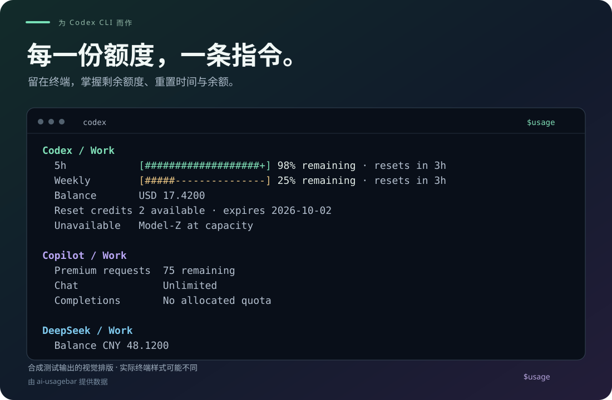

<div align="center">

<h1>usage for Codex CLI</h1>

<p>心中有余量，手上不停工。</p>

<p><a href="README.md">English</a> · <strong>简体中文</strong></p>
<p><a href="#安装">快速开始</a> · <a href="#使用">使用方式</a> · <a href="#排错">常见问题</a></p>

</div>



在 Codex CLI 中输入 `$usage`，查看各个 AI 账户的剩余额度、重置时间和余额。数据由 [ai-usagebar](https://github.com/akitaonrails/ai-usagebar) 提供。

*合成测试数据的排版示意，配色仅用于展示；CLI 报告默认使用英文。*

<details>
<summary>展开可复制的完整测试输出</summary>

```text
Codex / Work
  5h            [###################+] 98% remaining · resets in 3h
  Weekly        [#####---------------] 25% remaining · resets in 3h
  Balance       USD 17.4200
  Reset credits 2 available · expires 2026-10-02
  Unavailable   Model-Z at capacity

Copilot / Work
  Premium requests  75 remaining
  Chat              Unlimited
  Completions       No allocated quota

DeepSeek / Work
  Balance CNY 48.1200
```

这是 skill 在合成测试中的实际输出；名称和金额均为测试数据。

</details>

## 一眼看懂

| 额度 | 状态 | 轻量 |
| :--- | :--- | :--- |
| 剩余额度条与请求次数 | 重置时间与付费余额 | 一个 skill，一条指令 |
| 按账户与额度周期分组 | 清楚标记缓存和可用状态 | 需要时再看完整详情 |

可用服务商取决于你的 ai-usagebar 安装与配置。示例展示了 Codex、GitHub Copilot 和 DeepSeek；其他服务商及账户的设置请参阅[上游配置文档](https://github.com/akitaonrails/ai-usagebar/blob/main/docs/configuration.md)（英文）。

## 安装

### 1. 配置 ai-usagebar

安装 [Codex CLI](https://developers.openai.com/codex/cli)，并按照 [ai-usagebar 安装指南](https://github.com/akitaonrails/ai-usagebar#install)安装后端、配置要查询的服务商。

在运行 Codex 的终端中检查后端是否可用：

```sh
ai-usagebar --version
ai-usagebar usage --json
ai-usagebar vendors --json
```

如果命令提示尚未安装或账户配置缺失，请先在 ai-usagebar 中解决。本 skill 复用其已有的服务商配置。

### 2. 将 skill 添加到 Codex

将下面这段内容粘贴到 **Codex 对话中**，不要作为 shell 命令运行：

```text
$skill-installer Install the entire usage skill from https://github.com/wellorbetter/ai-usagebar-codex-skill/tree/main/usage, including scripts and references. Confirm the files were copied, say separately whether the backend was actually tested, and tell me to try $usage next turn. If it is not detected, suggest restarting Codex. Do not install runtimes or change global configuration.
```

<details>
<summary>手动安装</summary>

克隆本仓库，或下载 ZIP 后解压：

```sh
git clone https://github.com/wellorbetter/ai-usagebar-codex-skill.git
```

将**整个 `usage` 文件夹**（包括 `scripts` 和 `references`）复制到以下任一位置：

| 生效范围 | 安装位置 |
| --- | --- |
| 当前用户的所有项目 | `~/.agents/skills/usage/` |
| 单个仓库 | `<repository>/.agents/skills/usage/` |

Windows 中的 `~` 指用户目录，例如 `C:\Users\you`。父文件夹不存在时可先创建；若已安装 `usage`，请在替换前备份。

最终目录结构应为：

```text
.agents/skills/usage/
├── SKILL.md
├── scripts/
│   └── render.mjs
└── references/
    └── report.md
```

确认存在的是 `usage/SKILL.md`，而不是 `usage/usage/SKILL.md`。无需复制测试文件，也无需构建仓库。

</details>

安装位置和安装器用法依据 [Codex 官方 skills 指南](https://learn.chatgpt.com/docs/build-skills)（英文）。Codex 会自动检测新安装和更改的 skill；下一轮先试 `$usage`，若未识别再重启 Codex。安装在单个仓库时，应从该仓库内启动 Codex。

**安装完成后：** 确认整个 skill 文件夹已就位，下一轮在 Codex 中输入 $usage；未识别时再重启。文件已复制不代表后端或账户已验证，首次查询会分别检查这些问题。

已有 Node.js 20+ 时可使用随 skill 提供的彩色渲染脚本。没有 Node 仍会得到完整纯文本报告，查询不会替你安装运行时。

### 3. 查看用量

在 Codex CLI 中输入：

```text
$usage
```

Codex 会查询后端并返回易读的报告。`$usage` 是 Codex 内的 skill 调用方式，不是 shell 可执行命令，也不是内置的 `/usage` 命令。

## 使用

| 向 Codex 输入 | 获得的信息 |
| --- | --- |
| `$usage` | 剩余额度、重置时间、余额和需要处理的问题。 |
| `$usage details` | 原始报告值、额度窗口、余额明细、数据新鲜度和诊断信息。 |
| `$usage show provider configuration details` | 服务商目录中的配置信息。 |

生成的标题和状态文字默认使用**英语**，即使对话使用中文也是如此。服务商名称、账户名称和源数据保留原意。也可以使用 `$usage 查看详情` 请求详情。

**如何读额度条：** 条越满，表示剩余额度越多。含义明确的已用百分比会转换为剩余百分比；含义未知或相互冲突的数据不会显示容易误导的剩余额度条。详情保留原报告的方向，因此其中的百分比可能与默认视图不同。

**如何刷新：** 每次调用都会查询 ai-usagebar，由后者负责获取数据和缓存。若结果已过期，skill 可以通过已有的可用代理重试一次；再次失败时，展示可用的缓存值并简要说明原因。它是按需查询报告，再次输入 `$usage` 即可重新检查。

### 颜色与折叠输出

随 skill 提供的脚本可在兼容的 Codex CLI 中显示彩色工具输出。最终回答始终保留完整纯文本报告，工具卡片折叠也不会让关键信息不可见。已测试的 Windows CLI 0.154.0-alpha.6.2 可用 Ctrl+T 展开记录，其他版本可能不同。上方预览是合成数据示意，不保证终端配色完全一致。

明确要求纯文本或不要颜色时，skill 会关闭脚本颜色。自动模式遵守 NO_COLOR、TERM=dumb 和终端检测；对已确认兼容的 Codex 工具视图，skill 可以单次显式请求颜色，以应对 Codex 向工具子进程注入的禁色默认值。父级 TUI 仍决定实际显示效果。skill 不会修改环境或 Codex 配置；若你自行调整了继承的终端设置，再重启相关父终端/Codex 进程以加载变化。纯文本报告正常时，无需仅因没有颜色而重启。

## 排错

| 遇到的情况 | 检查方法 |
| --- | --- |
| Codex 找不到 `usage` | 核对上面的安装目录结构，然后重启 Codex。 |
| 无法启动 `ai-usagebar` | 确认已安装，并位于 Codex 继承的 PATH 中。 |
| 服务商提示需要配置或登录 | 按[上游配置文档](https://github.com/akitaonrails/ai-usagebar/blob/main/docs/configuration.md)操作，再运行 `$usage`。 |
| 显示缓存数据或刷新错误 | 检查后端网络连接和已有代理设置；用 `$usage details` 查看诊断。 |
| 缺少某个服务商或额度窗口 | 直接检查 `ai-usagebar usage --json`。skill 只能展示后端返回的数据。 |
| 没有颜色或脚本不可用 | 纯文本报告仍然完整。可检查已有 Node.js 20+、安装的 scripts 文件夹和 NO_COLOR/TERM 设置；颜色问题与后端配置分开处理。 |
| 某个值没有剩余额度条 | 其含义可能未知、存在冲突，或属于无限额度、未分配额度；详情中可查看源数据。 |

更新手动安装的版本时，先备份本地修改，再获取最新仓库版本并替换已安装的 `usage/` 文件夹。请始终将 `SKILL.md`、`scripts/` 和 `references/` 一起更新。原先通过安装器安装的版本也采用此备份后整目录替换方式；安装器可能拒绝已存在的目标目录，而不是直接更新。下一轮尝试 `$usage`，未识别更新时再重启 Codex。

## 工作原理

这是独立维护的 Codex skill。ai-usagebar 负责服务商集成、认证与缓存；本 skill 查询它的用量和服务商 JSON 报告，并在终端中呈现结果。

已核验的后端版本为 **ai-usagebar 1.17.0**。兼容说明、报告语义和实际测试的适用范围见[工作原理与兼容性](docs/compatibility.md)（英文）。

## 开发

使用 skill 无需构建项目。若要在本地检查已记录的行为，请先安装 Node.js，再从仓库根目录运行：

```sh
node --test tests/behavior.test.mjs tests/renderer.test.mjs
```

测试运行渲染器与控制字符输入检查，并检查 18 个已记录的合成用例，涵盖剩余额度、余额、缓存数据、部分失败和恶意输入。它验证保存的观察结果，不会查询你的账户或发起新的模型运行。修改 skill 或参考文件前，请先阅读[测试指南](tests/README.md)（英文）。

终端展示或 skill 指令的问题，请[在本仓库提交 issue](https://github.com/wellorbetter/ai-usagebar-codex-skill/issues)；服务商集成和后端数据的问题，请使用 [ai-usagebar 的 issue 跟踪页](https://github.com/akitaonrails/ai-usagebar/issues)。反馈时请提供合成或已脱敏的示例。

## 致谢

本项目基于 [akitaonrails/ai-usagebar](https://github.com/akitaonrails/ai-usagebar)，遵循维护者关于[外部 skill 集成的建议](https://github.com/akitaonrails/ai-usagebar/issues/187#issuecomment-5639100744)。本仓库独立维护 Codex 集成，与上游应用分别维护。
